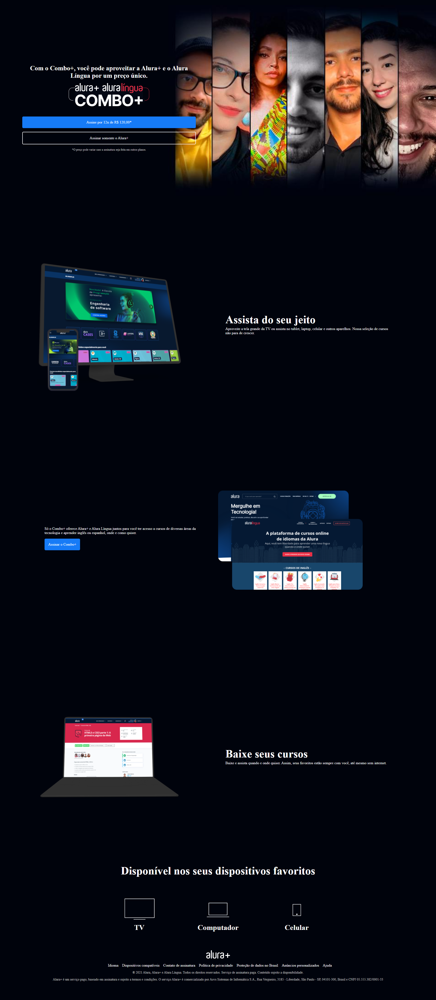

<h1>Alura+</h1>
                                                          

                                                                                   
:book: Projeto desenvolvido durante o curso HTML e CSS: praticando HTML/CSS da Alura
                                                          

  

